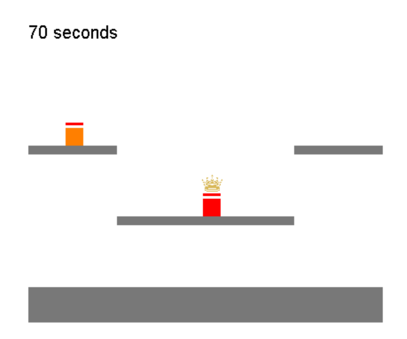

# Smash Rock Paper Scissors

Super Smash Brothers like game where players jump around. To attack they can use rock (f), paper (d), or scissors (s).

## client
1) download this repository
2) run the installer located in the 'dist' folder
3) once installed, go to the installed location and run 'client.exe'
4) type server ip address

## server
1) run `python3 server.py`
2) make sure port 54545 is open

## notes
This article was helpful when creating executables https://pythonprogramming.net/converting-pygame-executable-cx_freeze/
